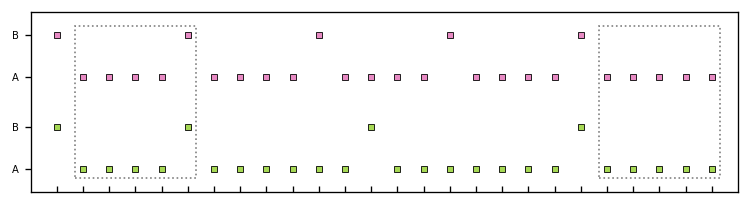

\newpage
# Method

### Participants

All participants were recruited at the Institute of Psychology at the University of Leipzig and reported good general health, normal hearing, and normal or corrected-to-normal vision. Written informed consent was obtained before the experiment. Participants were blinded to the purpose of the experiment and received compensation in course credit or money. 

For the 100 ms presentation rate, data were collected from twenty participants (2 males, average age 22.3 yrs., $SD=6.46$, range 18 - 41 yrs.).  The 150 ms presentation rate sample consisted of twenty-three psychology undergraduate students (2 males, average age 22.6 yrs., $SD=5.57$, range 18 - 42). Here, participants were also asked to provide information regarding their prior musical training: at the time of the survey, approximately one-third (34.8%) of participants engaged in musical activities, while 8.7% had no prior musical experience.

### Procedure and Stimuli

Participants sat in a comfortable chair in a sound-insulated chamber. The experimental setup was practically identical to that of Sussman et al.; however, instead of reading a book, subjects were asked to direct their attention to a silent but subtitled movie. Commercially available software (MATLAB R2014a; The MathWorks Inc, Natick, MA) in conjunction with the Psychophysics Toolbox extension
[version 3.0.12, @brainardPsychophysicsToolbox1997; @kleinerWhatNewPsychtoolbox32007] was used to control stimulus presentation. Stimuli consisted of pure sinusoidal tones with a duration of 50 ms (including a 10 ms cosine on/off ramp), presented isochronously at a stimulation onsets asynchrony (SOA) of 100 ms or 150 ms, respectively. Presentation of tones was blocked, and participants had the option to take a break after each block. Blocks contained 820 frequent 440 Hz tones ("A" tones) and 180 infrequent 449 Hz tones ("B" tones), delivered binaurally using Sennheiser HD-25-1 II headphones at approximately 70 dB ($Pr(B) = .18$, fixed for both conditions). For the 100 ms condition, participants were presented with 40 blocks, while 20 blocks were presented in the 150 ms condition. In one-half of the blocks, tones occurred in pseudo-random order (e.g., A-A-A-B-A-B-A}, *random* condition) while in the other half, tone presentation followed a simple pattern in which a five-tone-sequence of four frequent tones and one infrequent tone (i.e., A-A-A-A-B) was repeated cyclically (*predictable* condition). Block order was counterbalanced across participants. Additionally, A tones replaced 10% of designated (infrequent) B tones in the predictable condition, resulting in sporadic five-tone sequences consisting solely of A tones (i.e., A-A-A-A-A), thus violating the *pattern regularity* but not the *proportional regularity*. To assure comparability of local histories between tones of interest in both conditions, pseudo-randomly arranged tones were interspersed with sequences matching those from the predictable condition (i.e., B-A-A-A-A-B-A and B-A-A-A-A-A-A). Care was taken that sequences in the *random condition* were always separated by at least five pseudo-random tones and that in the *predictable condition*, A-A-A-A-A-patterns were always separated by at least two A-A-A-A-B-patterns. A total of 20,000 tones at 150 ms SOA or 40,000 tones at 100 ms SOA were delivered to each participant resulting in a total duration (excluding potential breaks) of 1 hour and 7 minutes (100 ms SOA) and 50 minutes (150 ms SOA), respectively.

#### Tones of Interest.
For all sequences, the fifth B or A tones (A-A-A-A-**B** or A-A-A-A-**A**, **boldface** marks the tone of interest) were compared to the preceding A tones (A-A-A-**A**-X). In For the 150 ms presentation rate, this setup resulted in 200 5th B tones, 200 5th A tones, and 400 4th A tones in the _random_ condition; and 1800 5th B tones, 200 5th A tones, and 2000 4th A tones in the *predictable* condition. For the 100 ms SOA, the number of tones was doubled: 400 () 5th B tones, 400 () 5th A tones, and 800 () 4th A tones in the _random_ condition; and 3600 () 5th B tones, 400 () 5th A tones and 4000 () 4th A tones in the *predictable* condition. Numbers in parenthesis indicate the average number of epochs after preprocessing.

### Data Acquisition
Electrophysiological data were recorded from active silver-silver-chloride (*Ag*-*AgCl*) electrodes using an ActiveTwo amplifier system (BioSemi B.V., Amsterdam, The Netherlands). A total of 39 channels were obtained using a 32-electrode-cap and seven external electrodes. Scalp electrode locations conformed to the international 10–20 system. Horizontal and vertical eye movement was obtained using two bipolar configurations with electrodes placed around the lateral canthi of the eyes as well as above and below the right eye. Additionally, three electrodes were placed on the tip of the nose and at the left and right mastoid sites. Data were sampled at 512 Hz and on-line low-pass filtered at 1000 Hz.

### Analysis Pipeline

Data preprocessing was implemented using a custom pipeline based on the *MNE Python* software package [@gramfortMEGEEGData2013] using *Python 3.7*. Computations were partly carried out on a cluster operated by the University Computation Center of the University of Leipzig. Code used in this thesis is publicly available at <https://github.com/marcpabst/xmas-oddballmatch>. 

First, EEG data were subjected to the ZapLine procedure [@decheveigneZapLineSimpleEffective2020] to remove line noise contamination. A fivefold detection procedure, as described by @bigdely-shamloPREPPipelineStandardized2015 was then used to detect and subsequently interpolate bad channels. Namely, this included detecting channels that contained prolonged segments with very small values (i.e., flat channels), the exclusion of channels based on robust standard deviation (deviation criterion), unusually pronounced high-frequency noise (noisiness criterion), and the removal of channels that were poorly predicted by nearby channels (correlation criterion and predictability criterion). Channels considered bad by one or more of these methods were removed and interpolated using spherical splines [@perrinSphericalSplinesScalp1989]. The BESA Spherical Head Model informed electrode locations for interpolations.

For independent component analysis (ICA), a 1-Hz-high-pass filter (134th order hamming-windowed FIR) was applied [@winklerInfluenceHighpassFiltering2015]. Artifact Subspace Reconstruction [ASR, @mullenRealtimeNeuroimagingCognitive2015] was used to identify and remove parts of the data with unusual noise characteristics (bursts). ICA was then carried out using the *Picard* algorithm [@ablinFasterICAOrthogonal2017; @ablinFasterIndependentComponent2018] on principal-component-analysis--whitened (PCA) data. PCA was also used for dimensionality reduction to avoid rank-deficiency when extracting components from data with one or more interpolated channels. The EEGLAB [version 2020.0, @delormeEEGLABOpenSource2004] software package and the IClabel plugin [version 1.2.6, @pion-tonachiniICLabelAutomatedElectroencephalographic2019] were used to classify estimated components automatically. Only components clearly classified (i.e., confidence above 50%) resulting from either eye movement, muscular, or heartbeat activity were zeroed-out before applying the mixing matrix to unfiltered data [^1]. 
A-A-A-A-**B**,
[^1]: However, it should be noted that this procedure deviated from the pre-registration in that it was fully automated. The pre-registration states that two experienced analysts should review ICA components. 

In line with recommendations from @widmannDigitalFilterDesign2015 and @decheveigneFiltersWhenWhy2019, a finite impulse response (FIR) bandpass filter from 0.1 Hz to 40 Hz (Hamming window, 0.1 Hz lower bandwidth, 5 Hz upper bandwidth, 0.0194 passband ripple, and 53 dB stopband attenuation) was applied. Continuous data were epoched into 400 ms long segments around stimulus onsets, including a 100 ms pre-stimulus interval. No baseline correction was applied, and segments exceeding a peak-to-peak voltage difference of  100 µV were removed. On average, (TODO) epochs were dopped. No dataset met the pre-registered exclusion criterion of less than 100 valid trials per condition; thus, data from all participants (20 for 100 ms presentation rate and 23 for 150 ms presentation rate) were included in the analysis.

### Statistical Analysis

Statistical analysis was carried out using the *R* programming language (version 3.2, The R Core Team) using the *rstatix* package [version 2.0, @kassambaraRstatixPipefriendlyFramework2020]. 

#### Mismatch Negativity.
Calculation of the dependant variable followed the original study's procedure in averaging amplitudes in a time window extending ±25 ms around the expected peak of negativity. Specifically, this peak was obtained by subtracting the average ERP following the A tones from the average ERP following B tones in the *random condition* for both presentation rates separately. To compute mean amplitudes, ERPs to 4th position A tones (A-A-A-**A**-X, **boldface** indicates the tone of interest) and B tones (A-A-A-A-**B**) were averaged separately for both the *random* and the *predictable* *condition*. For the *random condition*, only tones presented as part of a sequence matching the patterns from the *predictable* condition were included in the analysis. This set up resulted in 

In accordance with the original analysis by @sussmanOrganizationSequentialSounds2005, mean amplitudes for frontocentral electrodes (pooled FZ, F3, F4, FC1, and FC2) and the two mastoid positions (pooled M1 and M2) were averaged separately. Then, for both SOAs, independent two-way repeated-measures analyses of variance (ANOVA) with factors *condition* (levels *predictable* and *random*), *stimulus type* (levels *A tone* and *B tone*), and their interaction were calculated. Following this, significant interaction effects were further investigated using post-hoc *t*-tests.

#### Bayesian Analysis.
Going beyond the original study and extending the pre-registered procedure, Bayesian analysis was conducted for ANOVA posthoc comparisons. As mentioned above, traditional null hypothesis testing has some limitations that are often overlooked, leading to incorrect conclusions drawn from results. For example, not rejecting the null hypothesis ("non-significance") can usually not be interpreted as evidence in favor of the null hypothesis [e.g., @aczelQuantifyingSupportNull2018; @meehlTheoreticalRisksTabular1978; @kirkPracticalSignificanceConcept1996; @goodmanDirtyDozenTwelve2008]. Similarly, p-values might exaggerate evidence against $\mathcal{H_0}$ [that is, observed data might be more likely under $\mathcal{H_0}$ than under $\mathcal{H_1}$ even tough $\mathcal{H_0}$ is rejected, e.g., @hubbardWhyValuesAre2008; @rouderBayesianTestsAccepting2009; @wagenmakersBayesianInferencePsychology2018; @sellkeCalibrationValuesTesting2001].  Conversely, Bayesian hypothesis testing using Bayes factors can provide an intuitive way to compare observed data's likelihood under the null hypothesis versus the alternative hypothesis [@wagenmakersPracticalSolutionPervasive2007], thereby making it possible to evaluate the null hypothesis: $BF_{10} = \frac{Pr(data|\mathcal{H}_0)}{Pr(data|\mathcal{H}_1)}$. Here, this approach was applied in agreement with the concept described by @rouderBayesianTestsAccepting2009 as an alternative to classical frequentist paired *t*-tests. Following their sentiment, Bayes factors for within-participant differences $y_i$ were computed assuming $\mathcal{H_0}: y_i \sim Normal(0, \sigma^2)$ and $\mathcal{H_1}: y_i \sim Normal(\delta, \sigma^2)$; $\delta \sim Cauchy(0, 1/\sqrt{2})$. A Jeffreys prior was used for the variance $\sigma^2$ in both models:  $p(\sigma^2) \propto 1/\sigma^2$.  Calculations were performed using the Hamiltonian Monte Carlo method implemented in *Stan* [version 2.25, @carpenterStanProbabilisticProgramming2017] and *RStan* [@standevelopmentteamRStanInterfaceStan2020]. 

#### Reliability Analysis.
Finally, the relationship between epoch number and the reliability of the estimate was analyzed by drawing random subsamples of different sizes from both data sets and calculating split-half reliability employing the Spearman–Brown approach. Thus, single-trial responses for all A and B tones in the predictable condition were randomly shuffled. Then, $100, 200, ..., N_{max}$  ($N_{max, 100ms} = 2500, N_{max, 150ms}=1300$) epochs were drawn, randomly assigned to one of two halves, and averaged separately for A and B tones. Then, split-half reliability was calculated based on the mean amplitude in the MMN latency window as defined above. The Spearman–Brown prophecy formula[^2] [@brownEXPERIMENTALRESULTSCORRELATION1910; @spearmanCorrelationCalculatedFaulty1910] was used to obtain corrected reliability. This procedure was repeated 100 times for each $N$, and split-half-reliabilities obtained as such were subsequently averaged.

[^2]: as given by ${\rho}_{xx'} = \frac{2{\rho}_{12}}{1+{\rho}_{12}}$, where ${\rho_{12}}$ is the Pearson correlation coefficient between the two halfes. 

