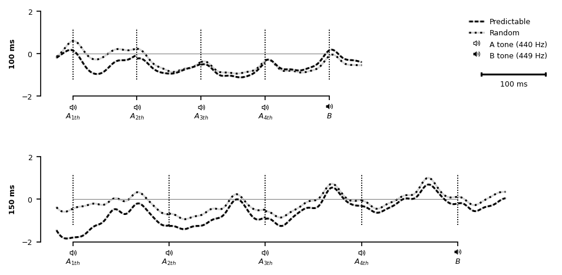
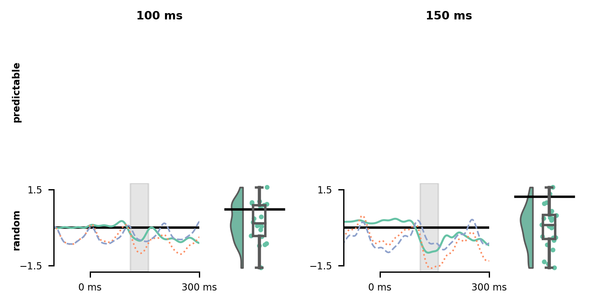

# Results

Figure X shows EEG waveform averages (pooled FZ, F3, F4, FC1, and FC2 electrode locations) for five-tone sequences (A-A-A-A-B) presented in a *predictable* (top panel) and *random* contexts (lower panel). 



Grand averages of the fronto-cluster (pooled FZ, F3, F4, FC1, and FC2 electrode locations) of event-related potentials for A tones (A-A-A-**A**-X) and B tones (A-A-A-A-**B**) and their difference (B-ERP - A-ERP) are displayed in Figure X for both 100 ms (left panel) and 150 ms (right panel) stimulus onset asynchrony. The top half of each panel shows ERPs in the *predictable condition* while the lower halfs depicts ERPs in the *random condition*. For both presentation rates, clear rythms matching the presentation frequency of 10 Hz (100 ms) respectivly 6.667 Hz (150 ms) are seen resulting from overlap of neighboring tones. Panels also show the distribution of amplitude differences in the MMN latency window as defined above (110 ms to 160 ms after stimulus onset) across particpants and the difference of topographic maps averaged over the same interval. 

Descriptivly, evoked responses were most negative in the 

![ERP grand averages (pooled FZ, F3, F4, FC1, and FC2 electrode locations) for an SOA of 100 ms (left) and 150 ms (right), for A tones (A-A-A-**A**-X, blue dashed lines) and B tones (A-A-A-A-**B**, orange dashed line) and their difference (B - A, green solid line). Upper panels show ERPs for tones presented in a predcitable pattern (*predcitable condition*) while lower panels show ERPs for tones presented in pseudo-random order (*random condition*). Shaded area marks MMN latency window (110 ms to 160 ms) used to calculate the distribution of amplitude differences across particpants (middle of each panel) and the difference of topographic maps averaged over the same interval (right of each panel).](figures/fig2.png)
ERPs from ooled mastoid electrode locations are shown in Figure X.
![ERP grand averages (pooled M1, M2 electrode locations) for an SOA of 100 ms (left) and 150 ms (right), for A tones (A-A-A-**A**-X, blue dashed lines) and B tones (A-A-A-A-**B**, orange dashed line) and their difference (B - A, green solid line). Upper panels show ERPs for tones presented in a predcitable pattern (*predcitable condition*) while lower panels show ERPs for tones presented in pseudo-random order (*random condition*). Shaded area marks MMN latency window (110 ms to 160 ms) used to calculate the distribution of amplitude differences across particpants.](figures/fig4.png)




```{=latex}
\input{tables/anova_02_full.tex}
```

For the 100 ms stimulation rate, the three-way ANOVA yielded a significant thre-way interaction effect condition x stimulus type x electrode ({{anova_02_100_condition_stimulustype_electrode}}) but revelad no main effects for neither stimulus type ({{anova_02_100_stimulustype}}), condition ({{anova_02_100_condition}}), nor electrode ({{anova_02_100_electrode}}). In contrast, for tones presented at a SOA of 150 ms, an effect was only found for the two-way interaction term stimulus type x electrode ({{anova_02_150_stimulustype_electrode}}). Mean amplitudes in the MMN latency window did not differ for factors stimulus type ({{anova_02_150_stimulustype}}), electrode ({{anova_01_150_electrode}) or condition ({{anova_01_150_condition}}).

To further investige the role of frontal and mastoid electrode locations, two 2-way ANOVAs were calculated for both 100 ms presentation and 150 ms presentation.


For the 150 ms stimulation rate, the 2-way ANOVA yielded a significant main effect for stimulus type ({{anova_01_150_stimulustype}}) but not for condition ({{anova_01_150_condition}}) or  stimulus type x condition interaction ({{anova_01_150_condition_stimulustype}}). In contrast, when presenting tones with a stimulus-onset-assychrnony of 100 ms, no such effects were found for the factor condition ({{anova_01_150_condition}}), stimulus type ({{anova_01_150_stimulustype}}), or interaction ({{anova_01_150_condition_stimulustype}}).

```{=latex}
\input{tables/desc_table.tex}
```


```{=latex}
\input{tables/anova_03_full.tex}
```