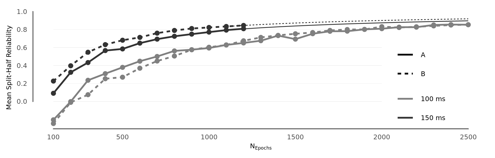

# Results

![ERP grand averages (pooled FZ, F3, F4, FC1, and FC2 electrode locations) for an SOA of 100 ms (left) and 150 ms (right), for A tones (A-A-A-**A**-X, blue dashed lines) and B tones (A-A-A-A-**B**, orange dashed line) and their difference (B - A, green solid line). Upper panels show ERPs for tones presented in a predcitable pattern (*predcitable condition*) while lower panels show ERPs for tones presented in pseudo-random order (*random condition*). Shaded area marks MMN latency window (110 ms to 160 ms) used to calculate the distribution of amplitude differences across particpants (middle of each panel) and the difference of topographic maps averaged over the same interval (right of each panel).](figures/fig_fronto.png){#fig:fronto}

Grand averages of event-related potentials (ERP) at pooled FZ, F3, F4, FC1, and FC2 electrode locations to A tones (A-A-A-**A**-X), B tones (A-A-A-A-**B**), and their difference (**B** tone minus **A** tone) are displayed in @fig:fronto for both 100 ms (left panel) and 150 ms (right panel) stimulus onset asynchronies. The top half of each panel shows ERPs in the *predictable condition* while the lower half depicts ERPs in the *random condition*. For both presentation rates, clear rhythms matching the presentation frequency of 10 Hz (100 ms) and respectively 6.667 Hz (150 ms) are seen as a result of substantial overlap of neighbouring tones. Panels also show the distribution of mean amplitude differences in the MMN latency window  (as defined above, 110 ms to 160 ms after stimulus onset) across participants and the difference of scalp topographies averaged over the same interval. Similarly, waveforms and mean amplitude difference distributions at pooled mastoid sites are shown in @fig:mastoids.

![ERP grand averages (pooled M1, M2 electrode locations) for an SOA of 100 ms (left) and 150 ms (right), for A tones (A-A-A-**A**-X, blue dashed lines) and B tones (A-A-A-A-**B**, orange dashed line) and their difference (B - A, green solid line). Upper panels show ERPs for tones presented in a predcitable pattern (*predcitable condition*) while lower panels show ERPs for tones presented in pseudo-random order (*random condition*). Shaded area marks MMN latency window (110 ms to 160 ms) used to calculate the distribution of amplitude differences across particpants.](figures/fig_mastoids.png){#fig:mastoids}


Evoked responses to A and B tones were compared by calculating mean amplitudes in the MMN latency window. Mean amplitudes in the MMN latency window and their standard deviations (SD) for all conditions are shown in Table X. Descriptively, mean amplitudes at pooled fronto-central electrode locations were more negative for randomly presented B tones than for randomly presented A tones, regardless of tone presentation rate (100 ms: {{{desc_rand_a_b_100}}}; 150 ms: {{{desc_rand_a_b_150}}}) This also held for tones presented predictably, but for the slower of the two presentation rates only ({{{desc_pred_a_b_150}}})). In contrast, when predictable tone patterns occurred at a faster 100 ms rate, B tones elicited descriptively more positive responses than A tones ({{{desc_pred_a_b_100}}}).  Descriptive comparison of evoked responses from pooled left and right mastoids revealed that pseudo-randomly presented B tones were more positive in the MMN latency window than A tones (100-ms-SOA: {{{desc_rand_a_b_100_mastoids}}}, 150-ms-SOA: {{{desc_rand_a_b_150_mastoids}}}). A similar observation could be made for predictable B tones compared to the preceding A tones at an SOA of 150 ms ({{{desc_pred_a_b_150_mastoids}}})) but not for the faster presentation rate ({{{desc_pred_a_b_100_mastoids}}}). 

```{=latex}
\input{tables/desc_table.tex}
```
Inference statistics provided support for these findings. For the 100 ms stimulation rate, the three-way ANOVA yielded a significant three-way interaction effect (*condition* x *stimulus type* x *electrode locations*; {{{anova_02_100_condition_stimulustype_electrode}}}) but failed to reveal main effects for factors *stimulus type* ({{{anova_02_100_stimulustype}}}), *condition* ({{{anova_02_100_condition}}}), and *electrode locations* ({{{anova_02_100_electrode}}}). In contrast, for tones presented at a SOA of 150 ms only the two-way interaction term *stimulus type* x *electrode locations* had a significant effect ({{{anova_02_150_stimulustype_electrode}}}). Mean amplitudes in the MMN latency window however did not differ for factors *stimulus type* ({{{anova_02_150_stimulustype}}}), *electrode locations* ({{{anova_02_150_electrode}}}) or *condition* ({{{anova_02_150_condition}}}).

```{=latex}
\input{tables/anova_02_full.tex}
```

Two-way ANOVAs (*condition* x *stimulus type*) were carried out separately for pooled fronto-central and mastoid electrode locations. For 100 ms tone presentation rate, the *condition* x *stimulus type* interaction only resulted in a significant effect for the fronto-central electrode cluster  ({{{anova_03_100_fronto_condition_stimulustype}}}) but not for pooled mastoid sites ({{{anova_03_100_mastoids_condition_stimulustype}}}) indicating that the three-way interaction effect *condition* x *stimulus type* x *electrode* is indeed driven by the amplitude differences in the fronto-central electrode locations . Contrary to this, for the 150 ms presentation rate, main effects for *stimulus type* were significant for both fronto-central and mastoid sites, suggesting that there was both an MMN at fronto-central locations as well as a polarity-reversal at the mastoid electrodes.

```{=latex}
\input{tables/anova_03_full.tex}
```
Post-hoc tests between ERPs to A and B tones were carried out using two-tailed Student's *t*-tests complemenary Bayesian analysis..  P-values were corrected for multiple comparisons using the Benjamini–Hochberg step-up procedure. For the 100 ms SOA, results indicated a significant effect only for predictable tones at fronto-central electrodes ({{{posthoc_pred_a_b_fronto_100}}}). For the 150 ms SOA, B tones elicited significantly more negative ERPs than B tones at fronto-central electrode locations in both predictable ({{{posthoc_pred_a_b_fronto_150}}}) and random ({{{posthoc_rand_a_b_fronto_150}}}) conditions. Significant polarity reversal effects at mastoid sites were only present for predictable ({{{posthoc_pred_a_b_mast_150}}}) tones but not for randomly presented ({{{posthoc_rand_a_b_mast_150}}}) tones.


To investigate whether absence of evidence for an MMN might be due to low whin-participant sample sizes, the anaylsis was repeated for the *random* condition including not only B tone trials that occured within a five-tone sequence (as with the pregistrated analyis path), but all B tones and their immediately preceding A tone. Results from this comparison are shown in @Fig:??.

{#fig:rel}

Split-half reliabilities are displayed in @fig:rel. Simulated values match the curve expected from the  Spearman-Brown formula. In the context of classcial test theory, this method relates the length of a test (or *experiment*) to the number of items (or *trials*). The first derivitve of the Spearman-Brown function is monotonically decreasing, leading to two different observation: i) Adding additional epochs (extending the test length by an absolute value in classcial test theory terms) has a large effect when the number of already present epochs is low, but has only little effect when already dealing with large numbers of epochs and ii) SOA and thus effect sized have a larger impact when epoch numbers are small compared to high epoch numbers. Graphed values also show that reliabilities for the 100 ms stimulation rate are considerably lower than for an SOA of 150 ms and that reliabilities are very low when using a relatively small number of epochs. There is no generally accepted rule as to the level above which the coefficient can be considered acceptable. Rather, reliabiliy should be evaluated based on the purpose of a study considering the cost-benefit trade-off [@nunnallyPsychometricTheory1994]. As laid out, inreased realibility comes at overproportionate cost, in that collecting more samples will not increase ralibility by the same factor. That said, many published articles deem reliability coefficients above .7 or .8 "acceptable" [@lanceSourcesFourCommonly2006].

Lorem ipsum dolor sit amet, consectetur adipiscing elit. Donec id cursus velit, non egestas quam. Aliquam rutrum eget sem ut aliquet. Etiam euismod purus et gravida volutpat. Suspendisse consequat ipsum nibh, vitae convallis dolor efficitur a. Suspendisse vehicula erat posuere velit fermentum viverra. Proin sapien urna, iaculis ut ultricies ac, auctor eu est. Nunc ornare pharetra finibus. Morbi finibus, ipsum non accumsan cursus, metus nisl egestas leo, et aliquam nisi leo quis diam. Quisque id diam non risus elementum convallis. Duis non nisl at nisl imperdiet vestibulum. Suspendisse efficitur porttitor nulla a vehicula. Interdum et malesuada fames ac ante ipsum primis in faucibus. Praesent tempor urna in orci congue, non euismod eros volutpat. Integer ullamcorper auctor libero, in laoreet nulla hendrerit ultrices.

Proin malesuada nisi et luctus volutpat. Nam ac posuere enim. Proin nec augue tincidunt felis ullamcorper luctus ac sit amet mi. Maecenas aliquam leo quis enim gravida maximus. Sed nec pellentesque magna. Vivamus et purus lacus. Donec maximus purus at fermentum efficitur. Phasellus auctor orci sem, eu sollicitudin eros pretium a.

In maximus libero at purus lobortis efficitur. Aliquam nec sapien consequat, lobortis lorem id, luctus velit. Pellentesque habitant morbi tristique senectus et netus et malesuada fames ac turpis egestas. Vestibulum dictum ipsum eu nunc maximus, quis ornare augue tincidunt. Nam leo purus, mollis quis nunc sed, sagittis tempus orci. In condimentum et neque ut laoreet. Curabitur accumsan ligula eu libero iaculis ullamcorper. Interdum et malesuada fames ac ante ipsum primis in faucibus. Nullam iaculis tellus risus, vitae dapibus augue commodo a. Sed ante dolor, fermentum at lectus id, pulvinar viverra elit. Aenean tincidunt mollis imperdiet.

Nulla id molestie neque, vitae vulputate velit. Fusce a velit imperdiet felis porttitor scelerisque. Nam tempus tincidunt elit, id finibus tortor tristique non. Ut imperdiet finibus mauris, in fringilla mauris blandit auctor. Etiam volutpat quam et feugiat elementum. Duis finibus fermentum condimentum. Donec sollicitudin molestie dolor. Cras convallis lorem orci, ut sagittis risus rutrum eget. Donec vel lobortis justo.

Pellentesque habitant morbi tristique senectus et netus et malesuada fames ac turpis egestas. Proin non leo vehicula, congue elit faucibus, tincidunt diam. Sed euismod vulputate mauris. Duis dapibus faucibus arcu, ut vehicula tellus blandit eu. Duis erat magna, cursus quis urna nec, placerat blandit lectus. Maecenas dolor quam, pharetra a urna eu, mollis iaculis dolor. Aliquam maximus ante eget felis faucibus porta. Cras semper felis non tellus rutrum tempus. Morbi quam metus, volutpat nec aliquam at, interdum a nibh. Sed hendrerit purus tempor ex placerat, ut fringilla nulla molestie. Nullam vitae sem non purus lobortis fermentum. Quisque ligula tellus, ullamcorper sit amet consectetur quis, fermentum ac mi. Nunc pretium mollis dictum.

\newpage


