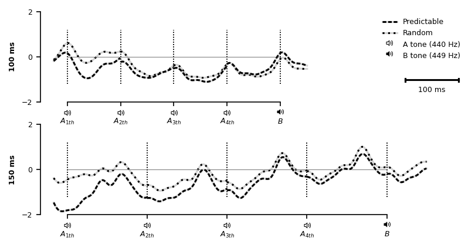

# Results

Grand averages of event-related potentials (ERP) at pooled FZ, F3, F4, FC1, and FC2 electrode locations to A tones (A-A-A-**A**-X), B tones (A-A-A-A-**B**), and their difference (**B** tone minus **A** tone) are displayed in Figure X for both 100 ms (left panel) and 150 ms (right panel) stimulus onset asynchronies. Top half of each panel shows ERPs in the *predictable condition* while lower half depicts ERPs in the *random condition*. For both presentation rates, clear rythms matching the presentation frequency of 10 Hz (100 ms) and respectivly 6.667 Hz (150 ms) are seen as a result from substantial overlap of neighboring tones. Panels also show the distribution of mean amplitude differences in the MMN latency window  (as defined above, 110 ms to 160 ms after stimulus onset) across particpants and the difference of sclap topogrphies averaged over the same interval. Simmilarly, waveforms and mean amplitude difference distributions at pooled mastoid sites are shown in Figure X.

![ERP grand averages (pooled FZ, F3, F4, FC1, and FC2 electrode locations) for an SOA of 100 ms (left) and 150 ms (right), for A tones (A-A-A-**A**-X, blue dashed lines) and B tones (A-A-A-A-**B**, orange dashed line) and their difference (B - A, green solid line). Upper panels show ERPs for tones presented in a predcitable pattern (*predcitable condition*) while lower panels show ERPs for tones presented in pseudo-random order (*random condition*). Shaded area marks MMN latency window (110 ms to 160 ms) used to calculate the distribution of amplitude differences across particpants (middle of each panel) and the difference of topographic maps averaged over the same interval (right of each panel).](figures/fig_fronto.png)

![ERP grand averages (pooled M1, M2 electrode locations) for an SOA of 100 ms (left) and 150 ms (right), for A tones (A-A-A-**A**-X, blue dashed lines) and B tones (A-A-A-A-**B**, orange dashed line) and their difference (B - A, green solid line). Upper panels show ERPs for tones presented in a predcitable pattern (*predcitable condition*) while lower panels show ERPs for tones presented in pseudo-random order (*random condition*). Shaded area marks MMN latency window (110 ms to 160 ms) used to calculate the distribution of amplitude differences across particpants.](figures/fig_mastoids.png)

Evoked responses to A and B tones were compared by calculating mean amplitudes in the MMN latency window. Mean amplitudes in the MMN latency window and their standard deviantions (SD) for all conditions are shown in Table X. Descriptively, mean amplitudes at pooled fronto-central electrode locations were more negative for randomly presented B tones than for randomly presented A tones, regardless of tone presentation rate (100 ms: $\Delta M = -0.358 \: \mu V$; 150 ms: $\Delta M = -0.555 \: \mu V$) This also held true for tones presented in a predictable fashion, but for the slower of the two presentation rates only ($\Delta M = -0.582 \: \mu V$)). In contrast, when predcitable tone patterns occured at a faster 100 ms rate, B tones elicted descriptively more positive responses than A tones ($\Delta M = 0.383 \: \mu V$).  Descriptive comparison of evoked responses from pooled left and right mostoids revealed that pseudo-randomly presented B tones were more positive in the MMN latency window than A tones (100-ms-SOA: $\Delta M = 0.746 \: \mu V$, 150-ms-SOA: $\Delta M = 0.510 \: \mu V$). A simmilar observation could be made for precitable B tones compared to the preceeding A tones at a SOA of 150 ms ($\Delta M = 0.399 \: \mu V$)) but not for the faster presentation rate ($\Delta M = -0.132 \: \mu V$). 

```{=latex}
\input{tables/desc_table.tex}
```
Statistical analyses provided support for these findings. For the 100 ms stimulation rate, the three-way ANOVA yielded a significant three-way interaction effect (*condition* x *stimulus type* x *electrode locations*; $F(1,19) = 7.53$, $p = 0.0130$) but failed to reveal main effects for factors *stimulus type* ($F(1,19) = 1.05$, $p = 0.3180$), *condition* ($F(1,19) = 0.83$, $p = 0.3730$), and *electrode locations* ($F(1,19) = 0.04$, $p = 0.8520$). In contrast, for tones presented at a SOA of 150 ms only the two-way interaction term *stimulus type* x *electrode locations* had a significant effect ($F(1,22) = 20.76$, $p = 0.0002$). Mean amplitudes in the MMN latency window however did not differ for factors *stimulus type* ($F(1,22) = 0.32$, $p = 0.5790$), *electrode locations* ().

```{=latex}
\input{tables/anova_02_full.tex}
```

Two-way ANOVAs (*Condition* x *Stimulus Type*) were carried out seperatly for pooled fronto-central and mostoid electrode locations. For 100 ms tone presenation rate,  the Condition x StimulusType interaction only revealed a significant effect for the fronto-central electrode cluster  ($F(1,19) = 16.75$, $p = 0.0006$) but not for pooled mastoid sites  ($F(1,19) = 2.37$, $p = 0.1410$) indicating that the 3-way interaction effect condition x stimulus type x electrode is indeed driven by the amplitude differnces in te fronto-central electrode locations . Contrary to this, for the 150 ms presentation rate, main effects for *stimulus type* were significant for both fronto-central and mastoid sites, suggesting that there was both a MMN at fronto-central locations as well as a polarity-reversal at the mastoid electrodes.

```{=latex}
\input{tables/anova_03_full.tex}
```

For the 150 ms stimulation rate, the 2-way ANOVA yielded a significant main effect for stimulus type ($F(1,22) = 22.67$, $p = 0.0001$) but not for condition ($F(1,22) = 0.95$, $p = 0.3410$) or  stimulus type x condition interaction ($F(1,22) = 0.03$, $p = 0.8680$). In contrast, when presenting tones with a stimulus-onset-assychrnony of 100 ms, no such effects were found for the factor condition ($F(1,22) = 0.95$, $p = 0.3410$), stimulus type ($F(1,22) = 22.67$, $p = 0.0001$), or interaction ($F(1,22) = 0.03$, $p = 0.8680$).

Figure X shows EEG waveform averages (pooled FZ, F3, F4, FC1, and FC2 electrode locations) for five-tone sequences (A-A-A-A-B) presented in a *predictable* (top panel) and *random* contexts (lower panel). 




\newpage


